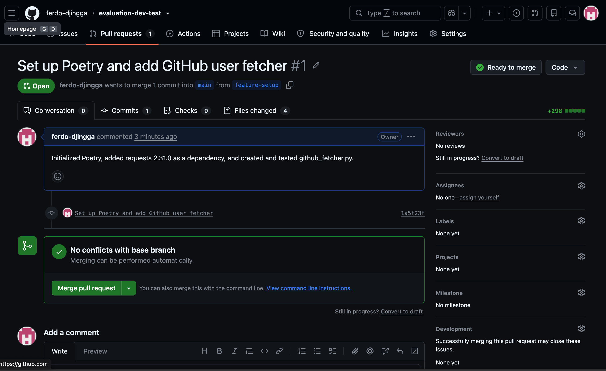
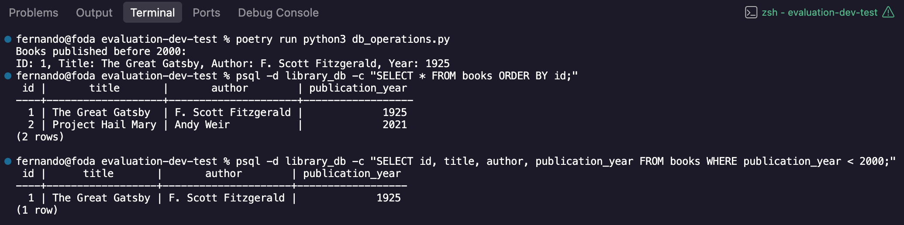
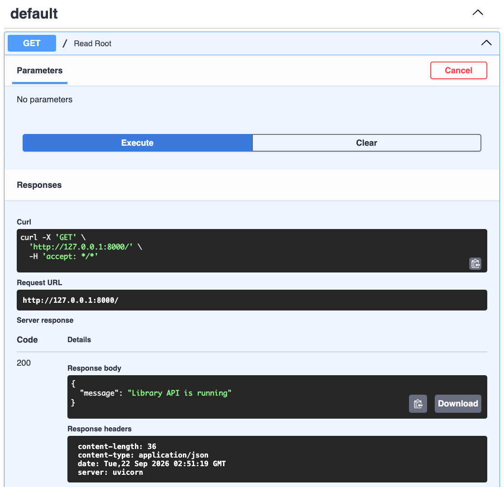
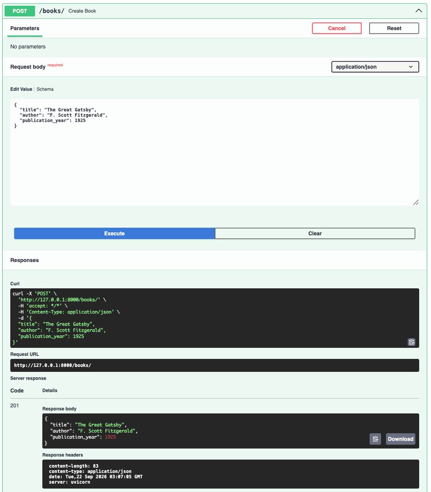
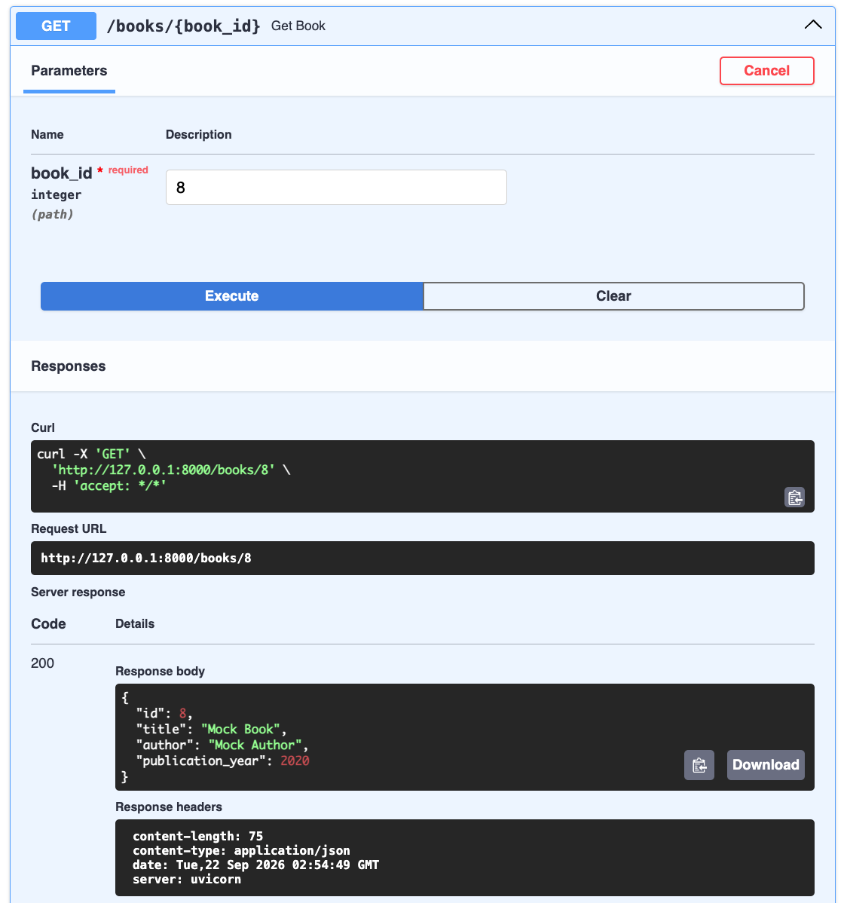
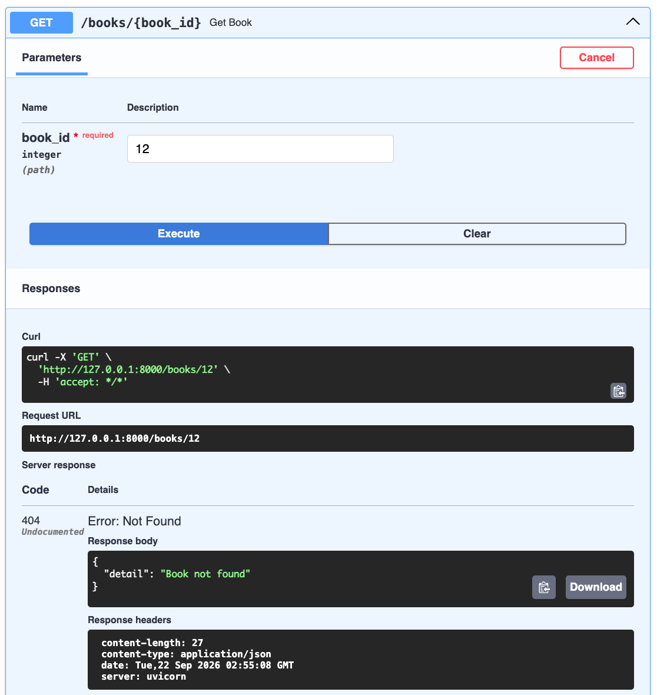
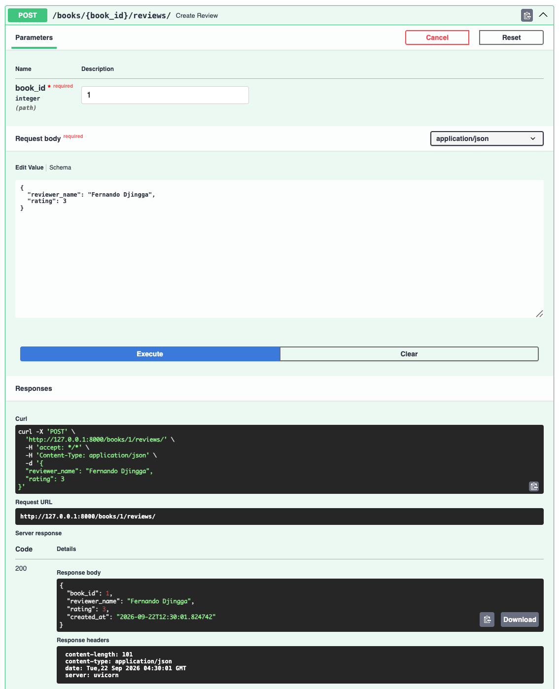

# Evaluation Dev Test

Junior Software Engineer Day 1 Assignment

## Install Dependencies

Install the Poetry dependencies:

```bash
poetry install --no-root
```

## PostgreSQL Setup

Start PostgreSQL and create the database:

```bash
brew services start postgresql
createdb library_db
```

Run the database script:

```bash
poetry run python db_operations.py
```

## MongoDB Setup

Start MongoDB:

```bash
brew services start mongodb-community
```

## Run the FastAPI App

```bash
poetry run uvicorn main:app --reload
```

Open the Swagger UI:

```text
http://127.0.0.1:8000/docs
```

Stop the server.

## Run Tests

Make sure MongoDB is running, then run:

```bash
poetry run pytest -v
```

## Other Script

Run the GitHub user fetcher:

```bash
poetry run python github_fetcher.py
```

## Screenshots

### GitHub Pull Request



### PostgreSQL Output



### FastAPI Swagger Tests









